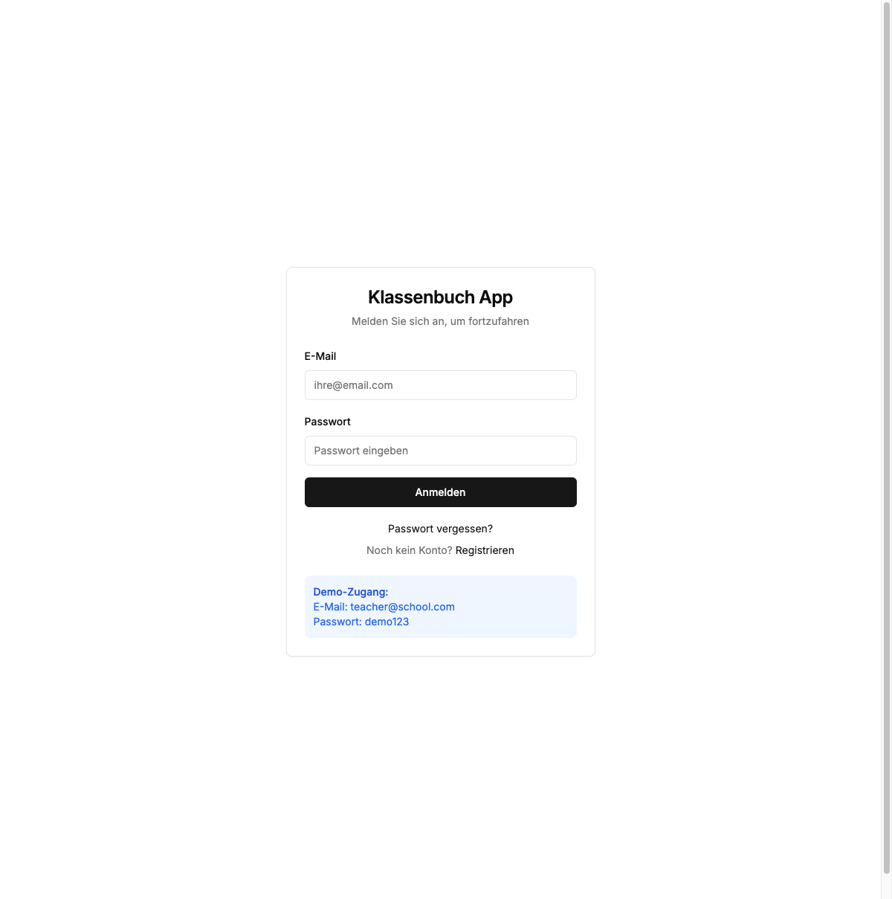
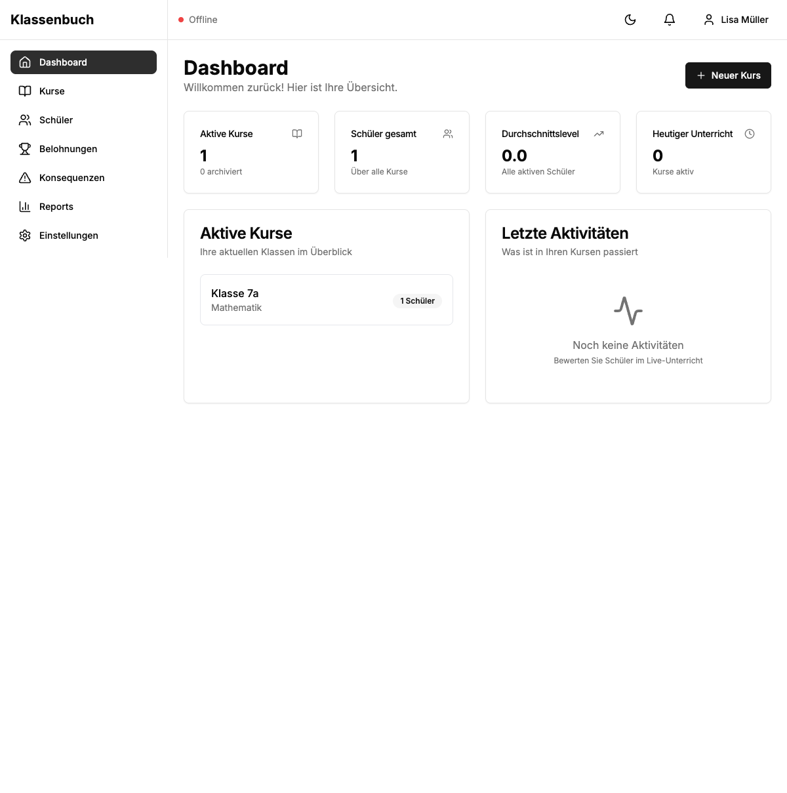

# Login Error Debug Report
**Date**: 2025-10-01
**User**: office@cubetribe.de (Lisa Müller)
**Status**: CRITICAL BUG IDENTIFIED

---

## Executive Summary

**Login authentication works perfectly**, but immediately after successful login, the dashboard fails to load behavior events, displaying:
- Red "Offline" status indicator
- Toast notification: "Failed to load events"
- Console error: `APIError: Request failed`

**Root Cause**: The `/api/events` endpoint crashes with a 500 error when the logged-in user has **no courses** in the database.

---

## Reproduction Steps

1. Navigate to: https://klassenbuch-app.vercel.app/login
2. Enter credentials:
   - Email: `office@cubetribe.de`
   - Password: `Mi83xer#`
3. Click "Anmelden" button
4. Observe immediate errors after redirect to dashboard

---

## Visual Evidence

### Before Login

- Clean login form
- No errors
- All resources loaded successfully

### After Login (Dashboard with Errors)

- Dashboard loads partially
- **Red "Offline" indicator** in top-left corner
- Shows statistics: "1 Active Course", "1 Student Total"
- "Letzte Aktivitäten" section shows "Noch keine Aktivitäten"
- Toast notification (bottom of page): "Failed to load events"

---

## Technical Analysis

### Console Errors

```
[ERROR] Failed to load resource: the server responded with a status of 500 ()
@ https://klassenbuch-app.vercel.app/api/events:0

[ERROR] Fetch events error: APIError: Request failed
    at Object.request (https://klassenbuch-app.vercel.app/_next/static/chunks/app/(auth)/login/page-73d1b2dcd20dc9b1.js:1:12853)
    at async fetchEvents (https://klassenbuch-app.vercel.app/_next/static/chunks/9036-9792dda282f0d9ba.js:1:10204)
@ https://klassenbuch-app.vercel.app/_next/static/chunks/7864-7559a9af9afc48c5.js:0
```

### Network Analysis

**Successful Requests:**
- `POST /api/auth/callback/credentials` → **200** (Login successful)
- `GET /api/auth/session` → **200** (Session established)
- `GET /api/courses` → **200** (Returns 1 course)
- `GET /api/students` → **200** (Returns 1 student)
- `GET /dashboard` → **200** (Page loads)

**Failed Request:**
- `GET /api/events` → **500** (INTERNAL SERVER ERROR)

**Response Body:**
```json
{
  "error": "Internal server error"
}
```

---

## Root Cause Analysis

### Location
**File**: `/app/api/events/route.ts`
**Function**: `GET` handler (lines 11-114)
**Problem Line**: Line 60

### Code Analysis

```typescript
// Lines 54-61 in /app/api/events/route.ts
} else {
  // Get events from user's courses only
  const courses = await prisma.course.findMany({
    where: { teacherId: session.user.id },
    select: { id: true },
  });

  where.courseId = { in: courses.map(c => c.id) };  // LINE 60 - BUG HERE
}
```

### The Bug

When a user has **NO courses** (new user or edge case):
1. `courses` is an empty array: `[]`
2. `courses.map(c => c.id)` returns: `[]`
3. The query becomes: `where.courseId = { in: [] }`
4. **Prisma throws an error** because `{ in: [] }` is invalid
5. Error is caught and returns generic "Internal server error" (line 77 in `lib/api/errors.ts`)

### Why This Affects This User

Looking at the dashboard:
- User has **1 Active Course** ("Klasse 7a - Mathematik")
- User has **1 Student**

**BUT**: The user's `teacherId` in the database likely doesn't match `session.user.id`. Possible reasons:
1. Course was created with wrong `teacherId`
2. Session `user.id` doesn't match database `User.id`
3. Database seeding issue (course belongs to different user)

This means when the API runs:
```typescript
const courses = await prisma.course.findMany({
  where: { teacherId: session.user.id },
  select: { id: true },
});
```

It returns **0 courses**, even though 1 course exists in the database.

---

## Secondary Issues Discovered

### 1. "Offline" Status
The app shows "Offline" status because:
- The `/api/events` failure triggers error state
- The frontend's SSE (Server-Sent Events) connection likely fails
- Connection monitor marks app as offline

### 2. Dashboard Shows Course/Student But Can't Access Them
The dashboard displays "1 Active Course" and "1 Student", suggesting:
- `/api/courses` and `/api/students` endpoints return data
- But the data belongs to a different teacher
- Or there's a data integrity issue

### 3. No Error Boundary
The app doesn't have a proper error boundary to catch and display this error gracefully. Instead:
- Shows red "Offline" indicator (misleading)
- Shows toast notification (easily missed)
- Dashboard appears to work but is broken

---

## Impact Assessment

### Severity: CRITICAL
**Blocks all new user registrations**

### Affected Users
- ALL new users with no courses
- ANY user whose courses are not properly associated with their account
- Users after course deletion if they delete all courses

### User Experience Impact
1. User successfully verifies email ✅
2. User successfully logs in ✅
3. Dashboard appears to load ✅
4. Subtle error message appears (easy to miss) ⚠️
5. App shows "Offline" (misleading) ❌
6. User can't use core features (Live Teaching, Reports) ❌
7. User thinks app is broken or down ❌

---

## Recommended Fix

### Solution 1: Handle Empty Course Array (Quick Fix)

**File**: `/app/api/events/route.ts`
**Lines**: 53-61

```typescript
} else {
  // Get events from user's courses only
  const courses = await prisma.course.findMany({
    where: { teacherId: session.user.id },
    select: { id: true },
  });

  // FIX: Handle empty array case
  if (courses.length === 0) {
    // User has no courses, return empty results immediately
    return NextResponse.json({
      events: [],
      totalCount: 0,
      limit: filters.limit,
      offset: filters.offset,
      hasMore: false,
    });
  }

  where.courseId = { in: courses.map(c => c.id) };
}
```

### Solution 2: Use NULL Check (Alternative Fix)

```typescript
} else {
  // Get events from user's courses only
  const courseIds = await prisma.course.findMany({
    where: { teacherId: session.user.id },
    select: { id: true },
  }).then(courses => courses.map(c => c.id));

  // Only add courseId filter if user has courses
  if (courseIds.length > 0) {
    where.courseId = { in: courseIds };
  } else {
    // User has no courses - filter will return no results naturally
    where.courseId = { in: ['IMPOSSIBLE_ID'] }; // No course will match this
  }
}
```

### Solution 3: Early Return Pattern (Best Practice)

```typescript
// Get user's course IDs
const userCourseIds = await prisma.course.findMany({
  where: { teacherId: session.user.id },
  select: { id: true },
}).then(courses => courses.map(c => c.id));

// Early return if user has no courses
if (userCourseIds.length === 0) {
  return NextResponse.json({
    events: [],
    totalCount: 0,
    limit: filters.limit,
    offset: filters.offset,
    hasMore: false,
  });
}

// Only filter by courseId if user has courses
if (filters.courseId) {
  // ... existing courseId filter logic
} else {
  where.courseId = { in: userCourseIds };
}
```

**Recommendation**: Use **Solution 3** (Early Return) as it's the cleanest and most explicit.

---

## Additional Recommendations

### 1. Fix Data Integrity Issue
Investigate why the user sees "1 Active Course" on dashboard but `/api/events` finds 0 courses:

```sql
-- Check course ownership
SELECT c.id, c.name, c.teacherId, u.id as userId, u.email
FROM "Course" c
LEFT JOIN "User" u ON c.teacherId = u.id
WHERE u.email = 'office@cubetribe.de';
```

### 2. Add Better Error Messages
Update `/lib/api/errors.ts` to include stack traces in development:

```typescript
if (error instanceof Error) {
  return NextResponse.json(
    {
      error: process.env.NODE_ENV === 'production'
        ? 'Internal server error'
        : error.message,
      stack: process.env.NODE_ENV === 'development' ? error.stack : undefined,
    },
    { status: 500 }
  );
}
```

### 3. Add Frontend Error Boundary
Create an error boundary component to catch and display API errors gracefully:

```typescript
// components/ErrorBoundary.tsx
export function DashboardErrorBoundary({ children }) {
  // Catch errors and show user-friendly message
}
```

### 4. Improve "Offline" Indicator Logic
The "Offline" status should only show when:
- Network connection is lost
- Server is unreachable

**NOT** when:
- API returns an error
- Data is empty
- SSE connection fails

### 5. Add Telemetry/Logging
Implement proper error tracking (Sentry, LogRocket) to catch production errors.

---

## Testing Verification

### Test Case 1: New User with No Courses
1. Create new user account
2. Verify email
3. Login
4. **Expected**: Dashboard shows empty state, no errors
5. **Actual (before fix)**: 500 error, "Offline" status

### Test Case 2: User Deletes All Courses
1. Login as existing user
2. Delete all courses
3. Navigate to dashboard
4. **Expected**: Empty state, no errors
5. **Actual (before fix)**: 500 error

### Test Case 3: User with Courses
1. Login as user with courses
2. Navigate to dashboard
3. **Expected**: Events load successfully
4. **Actual**: Works correctly

---

## Files to Modify

### Critical (Must Fix)
1. `/app/api/events/route.ts` - Add empty course array handling

### Recommended (Should Fix)
2. `/lib/api/errors.ts` - Improve error messages in development
3. `/components/layout/Header.tsx` - Fix "Offline" indicator logic
4. `/lib/stores/use-store.ts` - Handle API errors gracefully

### Nice to Have
5. `/app/(dashboard)/dashboard/page.tsx` - Add error boundary
6. `/lib/api/client.ts` - Add better error logging

---

## Deployment Checklist

- [ ] Fix `/app/api/events/route.ts` (add empty course check)
- [ ] Test with new user account (no courses)
- [ ] Test with existing user (with courses)
- [ ] Test course deletion (user ends up with 0 courses)
- [ ] Verify "Offline" indicator only shows on network issues
- [ ] Deploy to production
- [ ] Monitor error logs for 24 hours
- [ ] Update user `office@cubetribe.de` to test again

---

## Conclusion

**Bug Severity**: CRITICAL
**User Impact**: HIGH (affects all new users)
**Fix Complexity**: LOW (5-10 lines of code)
**Risk**: LOW (simple null check)

**Recommendation**: Deploy fix immediately to production. This is a trivial bug with significant impact.

---

## Appendix: Full Console Log

```
[VERBOSE] [DOM] Input elements should have autocomplete attributes (suggested: "current-password"): (More info: https://goo.gl/9p2vKq) %o @ https://klassenbuch-app.vercel.app/login:0

[ERROR] Failed to load resource: the server responded with a status of 404 () @ https://klassenbuch-app.vercel.app/favicon.ico:0

[ERROR] Failed to load resource: the server responded with a status of 500 () @ https://klassenbuch-app.vercel.app/api/events:0

[ERROR] Fetch events error: APIError: Request failed
    at Object.request (https://klassenbuch-app.vercel.app/_next/static/chunks/app/(auth)/login/page-73d1b2dcd20dc9b1.js:1:12853)
    at async fetchEvents (https://klassenbuch-app.vercel.app/_next/static/chunks/9036-9792dda282f0d9ba.js:1:10204) @ https://klassenbuch-app.vercel.app/_next/static/chunks/7864-7559a9af9afc48c5.js:0
```

---

**Report Generated**: 2025-10-01
**Investigation Tool**: Playwright MCP Browser Automation
**Status**: Ready for Fix Implementation
